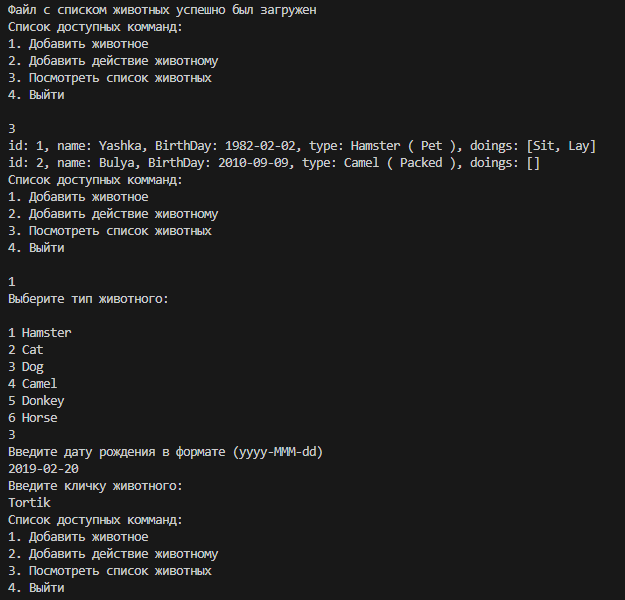
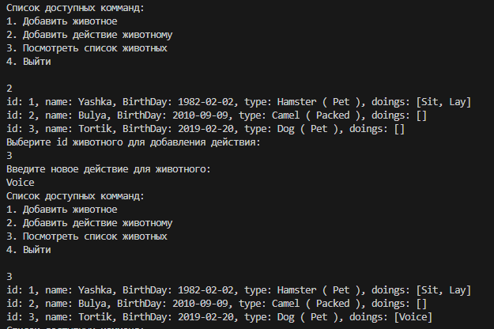

### 1. Используя команду cat в терминале операционной системы Linux, создать два файла Домашние животные (заполнив файл собаками, кошками, хомяками) и Вьючные животными заполнив файл Лошадьми, верблюдами и ослы), а затем объединить их.Просмотреть содержимое созданного файла.
Переименовать файл, дав ему новое имя (Друзья человека).


***
### 2. Создать директорию, переместить файл туда.


***

## 3. Работа с MySQL в Linux. “Установить MySQL на вашу вычислительную машину ”


***

### 4. Установить и удалить deb-пакет с помощью dpkg.

#### 4.1 Вначале установим пакет .dep

#### 4.2 Произошла ошибка зависимостей необходимо установить зависимости : mc-data

#### 4.3 Готовывй результат 

#### 4.4 Удалим пакет с помощью dpkg

***
### 5. Выложить историю команд в терминале ubuntu
Приложено выше скринами
***

### 6. Нарисовать диаграмму, в которой есть класс родительский класс, домашние животные и вьючные животные, в составы которых в случае домашних животных войдут классы: собаки, кошки, хомяки, а в класс вьючные животные войдут: Лошади, верблюды и ослы).


### 7. В подключенном MySQL репозитории создать базу данных “Друзья человека”


***
### 8-9. Создать таблицы с иерархией из диаграммы в БД.Заполнить низкоуровневые таблицы именами(животных), командами которые они выполняют и датами рождения.
[SQL файл](SQL/sqlAnimals.sql)

```
USE humanfriends;

CREATE TABLE IF NOT EXISTS Cats(
    id SERIAL PRIMARY KEY,
    Name VARCHAR(255) NOT NULL,
    Type VARCHAR(255) NOT NULL,
    BirthDay DATE NOT NULL,
    Commands VARCHAR(255) NOT NULL
);

INSERT Cats(Name, Type, BirthDay, Commands)
VALUES
('Tobik', 'Cat', '2008-10-23', 'Sit, Stay'),
('Barsik', 'Cat', '2020-08-23', 'Sit, Pounce'),
('Gavr', 'Cat', '2008-10-23', 'Sit, Scratch');

CREATE TABLE IF NOT EXISTS Dogs(
    id SERIAL PRIMARY KEY,
    Name VARCHAR(255) NOT NULL,
    Type VARCHAR(255) NOT NULL,
    BirthDay DATE NOT NULL,
    Commands VARCHAR(255) NOT NULL
);

INSERT Dogs(Name, Type, BirthDay, Commands)
VALUES
('Tor', 'Dog', '2019-11-09', 'Sit, Stay, Fetch'),
('Luna', 'Dog', '2020-08-23', 'Sit, Pounce'),
('Sharik', 'Dog', '2008-10-23', 'Sit, Scratch');

CREATE TABLE IF NOT EXISTS Hamsters(
    id SERIAL PRIMARY KEY,
    Name VARCHAR(255) NOT NULL,
    Type VARCHAR(255) NOT NULL,
    BirthDay DATE NOT NULL,
    Commands VARCHAR(255) NOT NULL
);

INSERT Hamsters(Name, Type, BirthDay, Commands)
VALUES
('Hammy', 'Hamster', '2020-01-02', 'Roll, Hide'),
('Ganny', 'Hamster', '2021-01-02', 'Roll, Hide'),
('Tonny', 'Hamster', '2022-01-02', 'Roll, Hide');

CREATE TABLE IF NOT EXISTS Horses(
    id SERIAL PRIMARY KEY,
    Name VARCHAR(255) NOT NULL,
    Type VARCHAR(255) NOT NULL,
    BirthDay DATE NOT NULL,
    Commands VARCHAR(255) NOT NULL
);
INSERT Horses(Name, Type, BirthDay, Commands)
VALUES
('Thunder', 'Horse', '2015-12-09', 'Trot, Canter'),
('Jonny', 'Horse', '2020-12-09', 'Trot, Canter'),
('Pon', 'Horse', '2022-12-09', 'Trot, Canter');

CREATE TABLE IF NOT EXISTS Camels(
    id SERIAL PRIMARY KEY,
    Name VARCHAR(255) NOT NULL,
    Type VARCHAR(255) NOT NULL,
    BirthDay DATE NOT NULL,
    Commands VARCHAR(255) NOT NULL
);
INSERT Camels(Name, Type, BirthDay, Commands)
VALUES
('Sandy', 'Camel', '2016-01-02', 'Walk, Carry'),
('Bandy', 'Camel', '2020-01-02', 'Walk, Carry'),
('Goody', 'Camel', '2022-01-02', 'Walk, Carry');

CREATE TABLE IF NOT EXISTS Donkeys(
    id SERIAL PRIMARY KEY,
    Name VARCHAR(255) NOT NULL,
    Type VARCHAR(255) NOT NULL,
    BirthDay DATE NOT NULL,
    Commands VARCHAR(255) NOT NULL
);

INSERT Donkeys(Name, Type, BirthDay, Commands)
VALUES
('Burro', 'Donkey', '2019-01-23', 'Walk, Kick'),
('Durro', 'Donkey', '2020-01-23', 'Walk, Kick'),
('Gurro', 'Donkey', '2021-01-23', 'Walk, Kick');

CREATE TABLE IF NOT EXISTS Pets AS (
SELECT Name, Type, BirthDay, Commands FROM Cats
UNION  
SELECT Name, Type, BirthDay, Commands FROM Dogs
UNION  
SELECT Name, Type, BirthDay, Commands FROM Hamsters
);

DELETE FROM Camels;

CREATE TABLE IF NOT EXISTS Pack_animals AS (
SELECT Name, Type, BirthDay, Commands FROM Horses
UNION  
SELECT Name, Type, BirthDay, Commands FROM Donkeys
UNION  
SELECT Name, Type, BirthDay, Commands FROM Camels
);

```
***
### 10. Удалив из таблицы верблюдов, т.к. верблюдов решили перевезти в другой питомник на зимовку. Объединить таблицы лошади, и ослы в одну таблицу.

```
DELETE FROM Camels;

CREATE TABLE IF NOT EXISTS Pack_animals AS (
SELECT Name, Type, BirthDay, Commands FROM Horses
UNION  
SELECT Name, Type, BirthDay, Commands FROM Donkeys
UNION  
SELECT Name, Type, BirthDay, Commands FROM Camels
);
```
Объединил и верблюдов т.к. на результат это не повлияет
***
### 11.Создать новую таблицу “молодые животные” в которую попадут все животные старше 1 года, но младше 3 лет и в отдельном столбце с точностью до месяца подсчитать возраст животных в новой таблице

```
CREATE TABLE IF NOT EXISTS young_animals AS (
SELECT Name, Type, BirthDay, TIMESTAMPDIFF(MONTH, BirthDay, CURDATE()) AS Age_Mounth 
FROM animals
WHERE TIMESTAMPDIFF(MONTH, BirthDay, CURDATE()) BETWEEN 12 AND 36
);
```
***
### 12. Объединить все таблицы в одну, при этом сохраняя поля, указывающие на прошлую принадлежность к старым таблицам.

```
CREATE TABLE IF NOT EXISTS animals AS (
SELECT Name, Type, BirthDay, Commands, 'Horses' AS Belong FROM Horses
UNION  
SELECT Name, Type, BirthDay, Commands, 'Donkeys' AS Belong FROM Donkeys
UNION  
SELECT Name, Type, BirthDay, Commands, 'Camels' AS Belong FROM Camels
UNION 
SELECT Name, Type, BirthDay, Commands, 'Cats' AS Belong FROM Cats
UNION  
SELECT Name, Type, BirthDay, Commands, 'Dogs' AS Belong FROM Dogs
UNION  
SELECT Name, Type, BirthDay, Commands, 'Hamsters' AS Belong FROM Hamsters
);
```
****
### 13.Создать класс с Инкапсуляцией методов и наследованием по диаграмме.
[Ссылка на классы реализованные по диаграмме (почти)](https://github.com/Elias-top/Final_Test_GB/tree/main/AnimalsStore/model/typesAnimals)
Использовал эти классы в роли типов животных. Мне показалось это более уместным, чем наследоваться от Animal (наследование происходит от TypesAnimal)

***

### 14. Написать программу, имитирующую работу реестра домашних животных.

[Ссылка на файлы программы](https://github.com/Elias-top/Final_Test_GB/tree/main/AnimalsStore)

### Структура проекта
Проект сделан в MVP паттерне.
- Main - стартовый файл, создает объект главного меню и вызывает метод начало работы с меню.
- ToysList.out - файл в который сохраняется изменения списка животных (!Примечание! сохранения происходит после корректного выхода из приложения. Загрузка происходит автоматически после запсука приложения)

## Компонент VIEW имеет следующие файлы:
- UserMainMenu - реализован базовый функционал главного меню для обычного пользователя в консоле для работы с доступными командами;
- View - интерфейс команд, который должен уметь реализовывать UI;
- ConsoleUI - в нем находятся реализация консольного интерфейса и вызов команд через Presenter (реализует интерфейс View);
- Директория commands содержит все доступные команды и их описание в консольном меню: (Добавление животного, добавление поведения животному, получение списка животных).
## Компонент PRESENTER имеет следующие файлы:
- Presenter - Необходим для связи между model (реализацией оснвоного функционала) и его вызова из View.
## Компонент MODEL имеет следующие файлы:
  - AnimalsInterface - интерфейс команд, который должен уметь реализовывать приложения для работы с животными:
    - Добавление животного;
    - Просмотр всех животных с информацией о дне рожденния о его поведениях;
    - Добавление нового поведения животному
  - Animal - файл объекта(сущности) животного со всем полями и методами;
  - AnimalsList - объект описывающий все команды для работы с животными (реализует интерфйес AnimalsInterface);
  - TypesAnimals - объект реализующий получение информации о типах и принадлежности животного;
  - Директория service содержит файл Service, в котором реализован вызов всех команд файла animalsList. Необходим для связи с Presenter 
## Дополнительно используемые библиотеки
- LocalDateTime - для формирования даты
- Scanner - для ввода информации с консоли 
- ArrayList\List - для работы массивами данных
- Serializable - для сохранения списка объектов игрушек в розыгрыше
- File - для создания файлов
- BufferedWriter - для созадния записей в файлах
## Примечание
Для работы с проектом была использован Java версии 17

# Пример работы приложения 
## Завести новое животное

Приложение автоматически предложит выбрать тип животного и потом отнесет автоматически к классу (Pet or Packed)

## Вывод инофрмации о животных

 
 Приложение выводит кличку животного, день его рождения, тип с пренадлежностью и его команды

 ## Обучение животного новым командам
 

